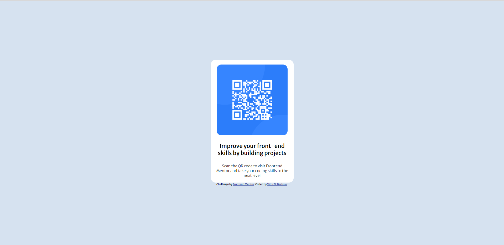
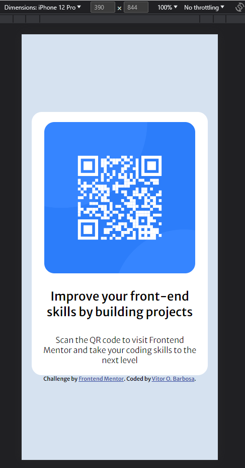

# Frontend Mentor - QR code component solution

This is a solution to the [QR code component challenge on Frontend Mentor](https://www.frontendmentor.io/challenges/qr-code-component-iux_sIO_H). Frontend Mentor challenges help you improve your coding skills by building realistic projects. 

## Table of contents

  - [Screenshot](#screenshot)
  - [Links](#links)
- [My process](#my-process)
  - [Built with](#built-with)
  - [What I learned](#what-i-learned)
- [Author](#author)

### Screenshot

### Links

- Live Site URL: [https://vitorob.github.io/QR-code-component/](https://your-live-site-url.com)

## My process

### Built with

- Semantic HTML5 markup
- CSS custom properties
- Flexbox

### What I learned

##### PT-BR
Nesse pequeno projeto, coloquei em pratica o uso do flexbox e um pouco do HTML semantico, é um projeto simples, mas que vale o aprendizado.

##### US
In this small project, I put into practice the use of flexbox and a bit of semantic HTML, it's a simple project, but worth learning.

## Author

- Frontend Mentor - [@VitorOB](https://www.frontendmentor.io/profile/VitorOB)
- LinkedIn - https://www.linkedin.com/in/vitorobarbosa/

